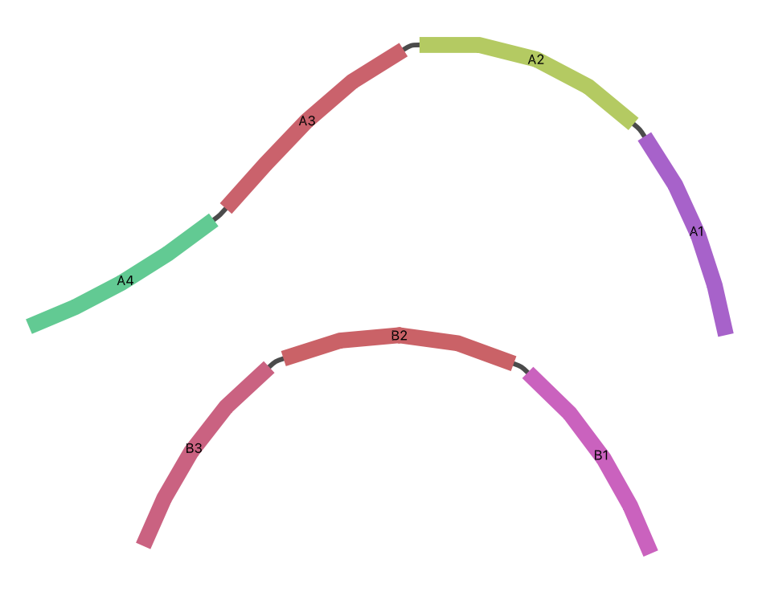

## Get constituent component of a segment

*agtools* can separate out the constituent component of a given segment and output the GFA file of that component. You can use the `component` subcommand provided through the command-line interface. Please refer to the [CLI reference](../cli.md) for further details on the `component` subcommand.

Here is an [example GFA file](https://github.com/Vini2/agtools/tree/main/docs/data/component_ex_graph.gfa).

```text
H	VN:Z:1.0
S	A1	ACGTAC
S	A2	CGTACG
S	A3	GTACGT
S	A4	TACGTA
S	B1	TTGCAA
S	B2	TGCAAG
S	B3	GCAAGT
L	A1	+	A2	+	5M
L	A2	+	A3	+	5M
L	A3	+	A4	+	5M
L	B1	+	B2	+	5M
L	B2	+	B3	+	5M
P	contig_A	A1+,A2+,A3+,A4+	5M,5M,5M
P	contig_B	B1+,B2+,B3+	5M,5M
```

The graph will look as follows. It has two connected components.



We want to get the component containing segment `A3`. You can run the following command to get the GFA file of the component.

```bash
agtools component -g test_graph.gfa -s A3 -o ./
```

The GFA file of the extracted component will look as below.

```text
H	VN:Z:1.0
S	A1	ACGTAC
S	A2	CGTACG
S	A3	GTACGT
S	A4	TACGTA
L	A1	+	A2	+	5M
L	A2	+	A3	+	5M
L	A3	+	A4	+	5M
P	contig_A	A1+,A2+,A3+,A4+	5M,5M,5M
```