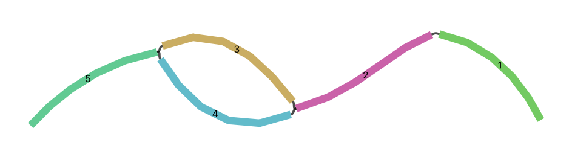
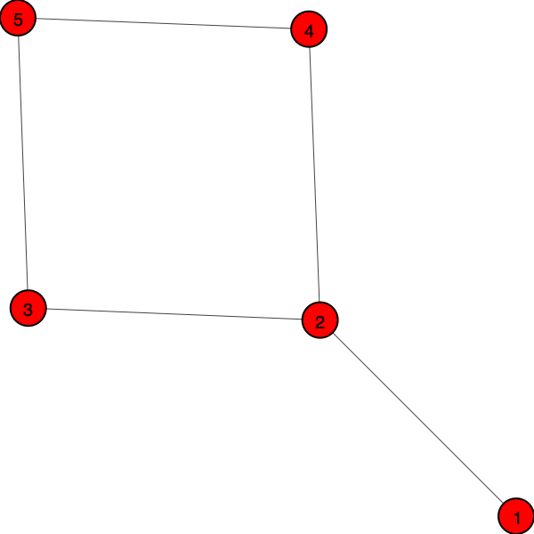

<link rel="stylesheet" href="https://cdn.jsdelivr.net/npm/bootstrap-icons@1.11.1/font/bootstrap-icons.css">

# Quick Start Guide

For those of you who are eager too get started, this quick start guide will cover the following basic operations with assembly graphs.

* Load an assembly graph
* Get basic graph-based statistics
* Get basic sequence-based statistics
* Get paths
* Query neighbours of a segment
* Get the adjacency matrix
* Query segment sequences
* Plot the graph

We will use the following [example assembly graph](https://github.com/Vini2/agtools/tree/main/docs/data/quickstart_assembly_graph.gfa).

```text
H	VN:Z:1.0
S	1	ACGTACGT
S	2	CGTACGTA
S	3	GTACGTAG
S	4	GTACGTAC
S	5	TACGTACC
L	1	+	2	+	7M
L	2	+	3	+	7M
L	2	+	4	+	7M
L	3	+	5	+	7M
L	4	+	5	+	7M
P	path1	1+,2+,3+,5+	7M,7M,7M
P	path2	1+,2+,4+,5+	7M,7M,7M
```

If you visualise this graph using [Bandage](https://rrwick.github.io/Bandage/), it will look as follows.



```python
from agtools.core.unitig_graph import UnitigGraph

import igraph as ig

# Load the unitig-level assembly graph from the GFA file
ug = UnitigGraph.from_gfa("assembly_graph.gfa")

# Print basic graph-based statistics
print(f"Number of vertices (segments): {ug.vcount}")
print(f"Number of edges (links): {ug.ecount}")
print(f"Number of self-loops (repeats): {len(ug.self_loops)}")
print(f"Average node degree: {ug.calculate_average_node_degree()}")
print(f"Number of connected components: {len(ug.get_connected_components())}")

# Print basic sequence-based statistics
print(f"Total length of segments: {ug.calculate_total_length()}")
print(f"Average length of segments: {ug.calculate_average_segment_length()}")
print(f"GC content of segments: {ug.get_gc_content()}")
print(f"N50 and L50: {ug.calculate_n50_l50()}")

# Print oriented links
for from_link in ug.oriented_links:
    for to_link in ug.oriented_links[from_link]:
        for orient in ug.oriented_links[from_link][to_link]:
            print(ug.segment_names[from_link], orient[0], "->", ug.segment_names[to_link], orient[1])

# Print paths
for path in ug.path_index:
    # Path name: path string, path overlaps
    print(path, ":", ug.get_path(path))

# Get neighbours of a segment
print(f"Neighbours of segment 5: {ug.get_neighbors("5")}")

# Print adjacency matrix
print("Adjancency matrix:")
print(ug.get_adjacency_matrix())

# Print segments
for seg_id in range(len(ug.segment_names)):
    # internal segment ID, segment name, segment sequence, segment length
    print(seg_id, ug.segment_names[seg_id], ug.get_segment_sequence(ug.segment_names[seg_id]), ug.segment_lengths[ug.segment_names[seg_id]])

# Plot the graph using igraph
ig.plot(
    ug.graph,                           # graph object
    "graph_plot.png",                   # file name
    vertex_label=ug.graph.vs["name"],   # label names
    vertex_size=40,                     # vertex size
    vertex_frame_width=2.0,             #vertex frame width
    vertex_label_size=20.0,             # vertex label size
)
```

The plotted graph will be as below.



<div class="button-container">
  <a href="../resources/quickstart.ipynb" download class="download-button">
    <i class="bi bi-download"></i> Download Jupyter notebook: quickstart.ipynb
  </a><br>
  <a href="../resources/quickstart.py" download class="download-button">
    <i class="bi bi-download"></i> Download Python source code: quickstart.py
  </a><br>
  <a href="../resources/quickstart.zip" download class="download-button">
    <i class="bi bi-download"></i> Download zipped: quickstart.zip
  </a>
</div>